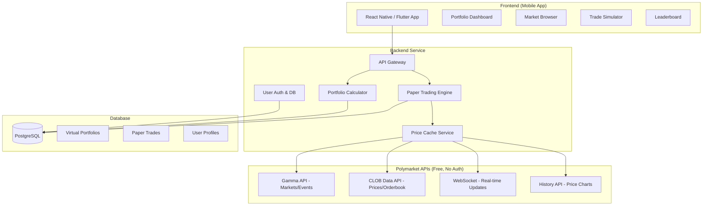

# Polymarket Paper Trading App — 可行性分析报告

## 📋 Executive Summary

**结论：这个idea技术上完全可行，商业上有明确的切入点，但需要注意竞品定位和变现路径。**

Polymarket **不提供** paper trading功能，但提供了 **极其丰富的公开API**，完全可以支撑构建一个高质量的 paper trading app。

---

## 1. Polymarket 是否支持 Paper Trading？

### ❌ 不支持

Polymarket 目前 **没有任何形式的 paper trading / simulated trading / demo mode**。所有交易都是真实的，需要用 pUSD (Polymarket USD) 作为抵押品在 Polygon 链上完成。

> [!IMPORTANT]
> 这意味着市场上存在一个明确的 **功能空白 (feature gap)**，你的app可以填补这个空白。

---

## 2. Polymarket API 生态系统 — 非常强大

Polymarket 提供了多套公开 API，**很多端点不需要认证**，这对 paper trading 应用来说是极好的消息。

### 2.1 可用 API 层级

| API | 认证要求 | 用途 | Paper Trading 可用性 |
|-----|---------|------|---------------------|
| **Gamma API** (`gamma-api.polymarket.com`) | ❌ 无需认证 | 获取事件/市场列表、市场详情、价格 | ✅ 核心数据源 |
| **CLOB Data API** (Market Data endpoints) | ❌ 无需认证 | 实时价格、order book、spread、midpoint、历史价格 | ✅ 核心数据源 |
| **WebSocket Channels** (Market Channel) | ❌ 无需认证 | 实时 orderbook 更新、价格变动、交易数据 | ✅ 实时推送 |
| **CLOB Trading API** | ✅ L2 Auth (API Key + 签名) | 下单、取消订单 | ⛔ 不需要 (paper trading 不需要真实下单) |
| **搜索 API** | ❌ 无需认证 | 搜索市场/事件/用户 | ✅ 可用 |
| **历史价格 API** | ❌ 无需认证 | 获取市场历史价格曲线 | ✅ 可用 |

### 2.2 关键可用端点

```
📊 市场数据 (无需认证):
GET /markets              → 列出所有市场
GET /markets/{id}         → 获取单个市场详情
GET /events               → 列出所有事件
GET /events/{id}          → 获取事件详情
GET /prices-history       → 历史价格数据
GET /midpoint             → 中间价
GET /spread               → 买卖价差
GET /book                 → 完整 order book
GET /last-trade-price     → 最新成交价

🔌 实时 WebSocket (无需认证):
Market Channel           → 实时 orderbook 更新
Sports Channel           → 体育比赛实时比分

🔍 搜索:
GET /search               → 搜索市场/事件/用户
```

### 2.3 Rate Limits

Polymarket 的 API 有 rate limit (具体限制见 [Rate Limits 文档](https://docs.polymarket.com/api-reference/rate-limits))，但对于 paper trading 场景来说足够。可通过以下策略应对：
- 服务端缓存热门市场数据
- WebSocket 替代轮询
- 申请 **Builder Program** 获取更高限额

### 2.4 Builder Program — 值得关注

Polymarket 有一个 **[Builder Program](https://docs.polymarket.com/builders/overview)**，允许第三方应用通过 Polymarket 路由订单。如果你的 app 未来想实现「从 paper trading 到真实交易的转换」，这是一条官方支持的路径。Builder 甚至可以赚取 **Builder Fees（订单归因费用）**。

---

## 3. 技术架构方案



### 3.1 核心模块

| 模块 | 功能 | 技术栈建议 |
|------|------|-----------|
| **Paper Trading Engine** | 模拟买入/卖出、持仓管理、盈亏计算 | Node.js/Python + PostgreSQL |
| **Price Feed Service** | 从 Polymarket API 实时拉取价格并缓存 | WebSocket + Redis |
| **Portfolio Calculator** | 实时计算虚拟组合价值、ROI | 服务端计算，定时刷新 |
| **Market Discovery** | 浏览/搜索 Polymarket 市场 | 直接代理 Gamma API |
| **Leaderboard & Social** | 排行榜、关注、分享交易记录 | PostgreSQL + 定时聚合 |
| **Resolution Handler** | 当市场 resolve 时自动结算虚拟持仓 | Webhook / 定时轮询 |

### 3.2 Paper Trade 模拟逻辑

```typescript
// 核心交易模拟 (简化版)
interface PaperTrade {
  userId: string;
  marketId: string;
  tokenId: string;        // Polymarket outcome token
  side: 'YES' | 'NO';
  shares: number;
  entryPrice: number;     // 从 CLOB midpoint API 获取
  timestamp: Date;
  status: 'OPEN' | 'CLOSED' | 'RESOLVED';
}

async function executePaperTrade(trade: PaperTradeRequest) {
  // 1. 从 Polymarket API 获取当前最佳价格
  const price = await getMarketPrice(trade.tokenId, trade.side);
  
  // 2. 检查用户虚拟余额
  const balance = await getVirtualBalance(trade.userId);
  const cost = price * trade.shares;
  if (cost > balance) throw new Error('Insufficient virtual balance');
  
  // 3. 记录虚拟交易
  await db.paperTrades.create({
    ...trade,
    entryPrice: price,
    cost: cost,
  });
  
  // 4. 更新虚拟余额
  await updateVirtualBalance(trade.userId, -cost);
}
```

### 3.3 关键约束 & 简化假设

> [!NOTE]
> Paper trading 可以做一些合理的简化，不需要完全模拟真实交易的所有复杂性：

| 真实交易 | Paper Trading 简化 |
|---------|-------------------|
| Order book 匹配 | 使用 midpoint price 直接成交 |
| 滑点 (slippage) | 可选：忽略 or 加固定 slippage% |
| Gas fees | 忽略 |
| Settlement delay | 即时成交 |
| Partial fill | 总是 full fill |
| 最小交易量 | 可以设置更低的门槛 |

---

## 4. 竞品分析

### 4.1 直接竞品 (Polymarket Paper Trading)

**目前不存在专门针对 Polymarket 的 paper trading app。** 这是一个空白市场。

### 4.2 间接竞品

| 平台 | 类型 | 是否免费/Paper | 区别 |
|------|------|--------------|------|
| **Manifold Markets** | Play-money 预测市场 | ✅ 虚拟货币交易 | 自有市场，非 Polymarket 数据 |
| **Metaculus** | 预测平台 | ✅ 免费预测 | 问答形式，无交易机制 |
| **Kalshi** | 真实预测市场 (US regulated) | ❌ 真金白银 | 无 paper trading |
| **PredictIt** | 真实预测市场 | ❌ 真金白银 | 已关停部分功能 |
| **Good Judgment Open** | 预测平台 | ✅ 免费 | 无交易机制 |
| **Stock Paper Trading Apps** (Webull, Thinkorswim) | 股票模拟交易 | ✅ Paper trading | 不同资产类别 |

### 4.3 你的差异化优势

1. **直接镜像 Polymarket 真实市场数据** — 不是"自建市场"，而是用真实的 Polymarket 价格
2. **零风险入门** — 吸引对 Polymarket 好奇但不敢投钱的用户
3. **练习 → 转化** — 自然漏斗：paper trading → 真实交易 (Builder Program)
4. **社交 & 竞赛** — Polymarket 本身社交功能弱

---

## 5. 商业可行性分析

### 5.1 目标用户画像

| 用户群 | 痛点 | 规模预估 |
|--------|------|---------|
| **Polymarket 围观者** | 想参与但不想/不能投真钱 | 🔥 很大，尤其美国用户 (Polymarket 限制 US 交易) |
| **新手交易者** | 想在投入真钱前先练手 | 中等 |
| **策略测试者** | 想验证预测策略但不想承担风险 | 中等 |
| **教育用户** | 老师/学生想了解预测市场 | 中等 |
| **合规受限用户** | 所在地区不允许真实交易 | 🔥 很大 (US 市场巨大) |

> [!TIP]
> **关键洞察：Polymarket 限制美国用户交易**，但美国是预测市场兴趣最大的市场。Paper trading app 可以合法服务这个被 Polymarket 排除的巨大用户群。

### 5.2 变现模式

| 模式 | 可行性 | 描述 |
|------|-------|------|
| **Freemium** | ✅ 推荐 | 基础功能免费 + 高级分析/更多虚拟资金/历史回测付费 |
| **Builder Fee 分成** | ✅ 推荐 | 用户从 paper trading 转真实交易时，通过 Builder Program 赚取佣金 |
| **广告** | ⚠️ 可行 | 展示广告（但会影响用户体验） |
| **数据 & 分析订阅** | ✅ 有潜力 | 高级图表、AI 预测、策略回测 |
| **B2B / White-label** | 💡 远期 | 为其他预测市场提供 paper trading 解决方案 |

### 5.3 SWOT 分析

| 优势 (S) | 劣势 (W) |
|----------|----------|
| 市场空白，无直接竞品 | 依赖 Polymarket API (单一平台风险) |
| API 免费且功能丰富 | Paper trading 用户付费意愿可能较低 |
| 美国市场需求未被满足 | 需要持续同步 Polymarket 数据 |
| Builder Program 提供变现路径 | 用户可能直接去 Polymarket 而不付费 |

| 机会 (O) | 威胁 (T) |
|----------|----------|
| 美国监管放开后的转化红利 | Polymarket 自己推出 paper trading |
| 扩展到多个预测市场平台 | API 变更或限制 |
| 社交/竞赛功能带来病毒传播 | Manifold Markets 等免费平台的间接竞争 |
| 教育市场 | 预测市场整体热度下降 |

---

## 6. MVP 功能规划

### Phase 1: MVP (4-6 周)
- [ ] 浏览 Polymarket 市场/事件 (Gamma API)
- [ ] 注册/登录 (email/社交登录)
- [ ] 虚拟资金 ($10,000 起始虚拟资金)
- [ ] 模拟买入/卖出 YES/NO 份额
- [ ] 持仓页 (当前持仓 + 实时盈亏)
- [ ] 市场 resolve 时自动结算

### Phase 2: 增长 (6-10 周)
- [ ] 排行榜 (按收益率、胜率排名)
- [ ] 交易历史 & 绩效分析
- [ ] 社交分享 (分享预测)
- [ ] Push 通知 (市场 resolve、价格剧烈变动)
- [ ] 历史价格图表

### Phase 3: 变现 (10+ 周)
- [ ] Premium 订阅 (高级分析、更多虚拟资金)
- [ ] Builder Program 集成 (一键跳转真实交易)
- [ ] AI 辅助预测建议
- [ ] 竞赛模式 (每周/每月竞赛)
- [ ] 支持 Kalshi 等其他平台

---

## 7. 技术风险评估

| 风险 | 严重程度 | 缓解策略 |
|------|---------|---------|
| Polymarket API 挂掉或变更 | 🟡 中等 | 做好数据缓存层，抽象 API 接口 |
| Rate limit 被打满 | 🟢 低 | WebSocket > 轮询，服务端缓存，申请 Builder tier |
| 价格延迟导致模拟不准 | 🟢 低 | 使用 WebSocket 实时推送，可接受几秒延迟 |
| Polymarket 封禁第三方应用 | 🟡 中等 | 仅使用公开 API，不做 scraping，加入 Builder Program 获得官方支持 |
| 法律合规风险 | 🟢 低 | Paper trading 不涉及真实金钱，法律风险极低 |

---

## 8. 最终建议

> [!TIP]
> **推荐执行。** 这个idea在以下几个维度都成立：
>
> 1. **技术可行** — Polymarket API 极其丰富，Market Data 全部免费开放
> 2. **市场空白** — 没有直接竞品
> 3. **用户需求明确** — 尤其是被限制的美国用户
> 4. **变现路径清晰** — Freemium + Builder Program 分成
> 5. **MVP 可快速验证** — 4-6 周可以出 MVP

### 下一步行动建议

1. **立即**：用 Polymarket Gamma API 做一个最小 prototype，验证 API 数据质量和延迟
2. **1 周内**：明确技术栈 (React Native vs Flutter, backend infra)
3. **2-4 周**：构建 MVP 核心功能 (浏览 + 模拟交易 + 持仓)
4. **发布前**：申请 Polymarket Builder Program
5. **发布后**：关注用户留存和付费转化率

---

*分析完成于 2026-06-20 | 数据来源: [Polymarket 官方文档](https://docs.polymarket.com/)*
