# Polymarket Paper Trading App — Technical Architecture

> **Version:** 1.0  
> **Last Updated:** 2026-06-20  
> **Status:** Approved for MVP Development

---

## Table of Contents

1. [System Overview](#1-system-overview)
2. [Technology Stack](#2-technology-stack)
3. [Database Schema](#3-database-schema)
4. [API Design](#4-api-design)
5. [Paper Trading Engine Design](#5-paper-trading-engine-design)
6. [Data Flow Diagrams](#6-data-flow-diagrams)
7. [Frontend Architecture](#7-frontend-architecture)
8. [Background Jobs](#8-background-jobs)
9. [Deployment Architecture](#9-deployment-architecture)
10. [Security Considerations](#10-security-considerations)
11. [Scaling Considerations](#11-scaling-considerations)
12. [Cost Estimation](#12-cost-estimation)

---

## 1. System Overview

### 1.1 High-Level Architecture

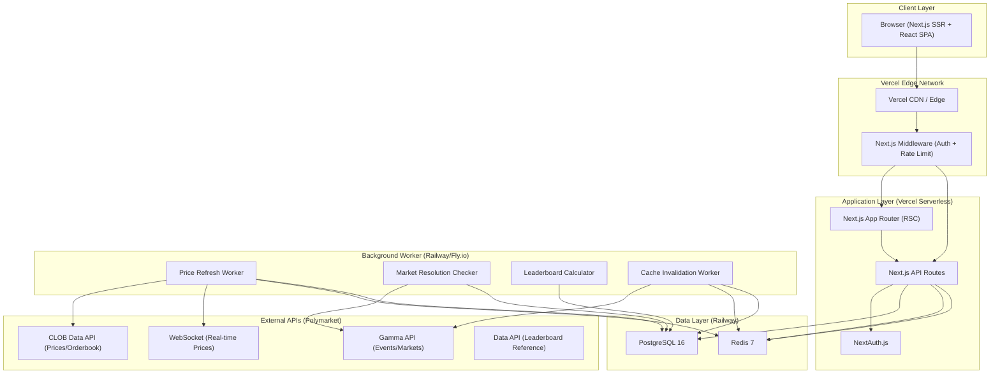

### 1.2 Component Descriptions

| Component | Responsibility | Notes |
|-----------|---------------|-------|
| **Next.js App Router** | Server-side rendering, routing, React Server Components | Handles all page rendering and client navigation |
| **Next.js API Routes** | REST API layer for all app operations | Serverless functions on Vercel |
| **NextAuth.js** | Authentication & session management | Email magic link + Google OAuth |
| **PostgreSQL** | Primary data store for all persistent data | Users, trades, positions, portfolio |
| **Redis** | Caching layer for market data and price feeds | TTL-based invalidation, pub/sub for real-time |
| **Price Refresh Worker** | Continuously fetches latest prices from Polymarket | Long-running process on Railway |
| **Resolution Checker** | Monitors markets for resolution events | Cron-based, settles positions automatically |
| **Leaderboard Calculator** | Periodic P&L aggregation for rankings | Runs every 15 minutes |
| **Cache Invalidation Worker** | Refreshes stale market metadata | Manages market_cache table lifecycle |

### 1.3 Key Design Principles

1. **Read-Heavy Optimization** — Most users browse markets and check portfolios; writes (trades) are infrequent by comparison. Cache aggressively.
2. **Eventual Consistency for Prices** — Paper trading does not require real-time tick-level accuracy. Prices cached for 5–15 seconds are acceptable.
3. **Idempotent Trade Execution** — Every trade request carries a client-generated idempotency key to prevent double-execution.
4. **Separation of Concerns** — The Next.js app handles request/response; long-running jobs run on a dedicated worker to avoid serverless timeouts.

---

## 2. Technology Stack

### 2.1 Stack Summary

| Layer | Technology | Version |
|-------|-----------|---------|
| **Frontend Framework** | Next.js (App Router) | 15.x |
| **UI Library** | React | 19.x |
| **Styling** | Tailwind CSS + shadcn/ui | 4.x / latest |
| **State Management** | Zustand + React Query (TanStack Query) | 5.x / 5.x |
| **Backend** | Next.js API Routes (serverless) | 15.x |
| **Background Worker** | Node.js standalone process | 22 LTS |
| **ORM** | Drizzle ORM | 0.38.x |
| **Database** | PostgreSQL | 16.x |
| **Cache** | Redis (Upstash or Railway-hosted) | 7.x |
| **Authentication** | NextAuth.js (Auth.js v5) | 5.x |
| **Validation** | Zod | 3.x |
| **Charts** | Recharts or Lightweight Charts (TradingView) | latest |
| **Deployment (App)** | Vercel | — |
| **Deployment (Infra)** | Railway or Fly.io | — |
| **CI/CD** | GitHub Actions | — |
| **Monitoring** | Vercel Analytics + Sentry | — |

### 2.2 Technology Justification

#### Next.js 15 (App Router)

- **Server Components** reduce client-side JavaScript bundle size for market listing pages that are mostly static.
- **Streaming SSR** enables progressive loading — render the page shell immediately, stream in market data as it arrives.
- **API Routes** colocate the backend with the frontend, simplifying development and deployment for an MVP.
- **Built-in optimizations** — image optimization, font loading, code splitting — reduce time-to-interactive.
- **Vercel deployment** is zero-config, with automatic preview deployments for every PR.

#### PostgreSQL with Drizzle ORM

- **PostgreSQL** is the gold standard for relational data with complex queries (P&L calculations, leaderboard aggregations, portfolio joins).
- **Drizzle ORM** provides type-safe SQL with minimal abstraction overhead. Unlike Prisma, Drizzle generates SQL that maps 1:1 to what you write, giving full control over query performance. Its schema-as-code approach integrates naturally with TypeScript.

#### Redis

- **Price caching** — Polymarket prices change frequently but our paper trading engine only needs prices accurate to ~5 seconds. Redis provides sub-millisecond reads.
- **Rate limit counters** — Token bucket or sliding window rate limiting with Redis atomic operations.
- **Session caching** — Optional session store to reduce DB reads on every authenticated request.

#### NextAuth.js (Auth.js v5)

- **Battle-tested** authentication library purpose-built for Next.js.
- **Supports** email magic links (passwordless) and Google OAuth out of the box.
- **Database sessions** with PostgreSQL adapter — no JWTs exposed to the client.
- **CSRF protection** built-in for all auth flows.

---

## 3. Database Schema

### 3.1 Entity Relationship Diagram

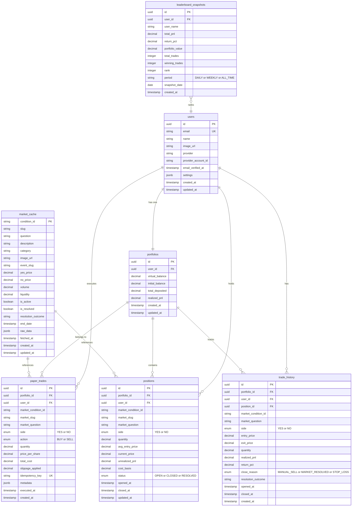

### 3.2 Drizzle ORM Schema Definitions

```typescript
// src/db/schema.ts

import {
  pgTable,
  uuid,
  text,
  varchar,
  decimal,
  timestamp,
  boolean,
  jsonb,
  integer,
  date,
  pgEnum,
  uniqueIndex,
  index,
} from "drizzle-orm/pg-core";
import { relations } from "drizzle-orm";

// ─── Enums ───────────────────────────────────────────────────────────

export const tradeSideEnum = pgEnum("trade_side", ["YES", "NO"]);
export const tradeActionEnum = pgEnum("trade_action", ["BUY", "SELL"]);
export const positionStatusEnum = pgEnum("position_status", [
  "OPEN",
  "CLOSED",
  "RESOLVED",
]);
export const closeReasonEnum = pgEnum("close_reason", [
  "MANUAL_SELL",
  "MARKET_RESOLVED",
  "STOP_LOSS",
]);
export const leaderboardPeriodEnum = pgEnum("leaderboard_period", [
  "DAILY",
  "WEEKLY",
  "ALL_TIME",
]);

// ─── Users ───────────────────────────────────────────────────────────

export const users = pgTable(
  "users",
  {
    id: uuid("id").primaryKey().defaultRandom(),
    email: varchar("email", { length: 255 }).notNull(),
    name: varchar("name", { length: 255 }),
    imageUrl: text("image_url"),
    provider: varchar("provider", { length: 50 }), // 'google' | 'email'
    providerAccountId: varchar("provider_account_id", { length: 255 }),
    emailVerifiedAt: timestamp("email_verified_at", { withTimezone: true }),
    settings: jsonb("settings").default({
      defaultTradeSize: 100,
      slippageEnabled: false,
      slippageBps: 50,
      theme: "system",
      notifications: true,
    }),
    createdAt: timestamp("created_at", { withTimezone: true })
      .notNull()
      .defaultNow(),
    updatedAt: timestamp("updated_at", { withTimezone: true })
      .notNull()
      .defaultNow(),
  },
  (table) => [
    uniqueIndex("users_email_idx").on(table.email),
    index("users_provider_idx").on(table.provider, table.providerAccountId),
  ]
);

// ─── Portfolios ──────────────────────────────────────────────────────

export const portfolios = pgTable(
  "portfolios",
  {
    id: uuid("id").primaryKey().defaultRandom(),
    userId: uuid("user_id")
      .notNull()
      .references(() => users.id, { onDelete: "cascade" }),
    virtualBalance: decimal("virtual_balance", {
      precision: 18,
      scale: 6,
    })
      .notNull()
      .default("10000.000000"), // Start with $10,000
    initialBalance: decimal("initial_balance", {
      precision: 18,
      scale: 6,
    })
      .notNull()
      .default("10000.000000"),
    totalDeposited: decimal("total_deposited", {
      precision: 18,
      scale: 6,
    })
      .notNull()
      .default("10000.000000"),
    realizedPnl: decimal("realized_pnl", { precision: 18, scale: 6 })
      .notNull()
      .default("0.000000"),
    createdAt: timestamp("created_at", { withTimezone: true })
      .notNull()
      .defaultNow(),
    updatedAt: timestamp("updated_at", { withTimezone: true })
      .notNull()
      .defaultNow(),
  },
  (table) => [
    uniqueIndex("portfolios_user_id_idx").on(table.userId),
  ]
);

// ─── Paper Trades ────────────────────────────────────────────────────

export const paperTrades = pgTable(
  "paper_trades",
  {
    id: uuid("id").primaryKey().defaultRandom(),
    portfolioId: uuid("portfolio_id")
      .notNull()
      .references(() => portfolios.id, { onDelete: "cascade" }),
    userId: uuid("user_id")
      .notNull()
      .references(() => users.id, { onDelete: "cascade" }),
    marketConditionId: varchar("market_condition_id", { length: 255 })
      .notNull(),
    marketSlug: varchar("market_slug", { length: 512 }),
    marketQuestion: text("market_question"),
    side: tradeSideEnum("side").notNull(), // YES or NO
    action: tradeActionEnum("action").notNull(), // BUY or SELL
    quantity: decimal("quantity", { precision: 18, scale: 6 }).notNull(),
    pricePerShare: decimal("price_per_share", {
      precision: 18,
      scale: 6,
    }).notNull(),
    totalCost: decimal("total_cost", { precision: 18, scale: 6 }).notNull(),
    slippageApplied: decimal("slippage_applied", {
      precision: 18,
      scale: 6,
    }).default("0.000000"),
    idempotencyKey: varchar("idempotency_key", { length: 64 }).notNull(),
    metadata: jsonb("metadata"), // Extra context: orderbook snapshot, etc.
    executedAt: timestamp("executed_at", { withTimezone: true })
      .notNull()
      .defaultNow(),
    createdAt: timestamp("created_at", { withTimezone: true })
      .notNull()
      .defaultNow(),
  },
  (table) => [
    uniqueIndex("paper_trades_idempotency_idx").on(table.idempotencyKey),
    index("paper_trades_user_idx").on(table.userId),
    index("paper_trades_portfolio_idx").on(table.portfolioId),
    index("paper_trades_market_idx").on(table.marketConditionId),
    index("paper_trades_executed_at_idx").on(table.executedAt),
  ]
);

// ─── Positions ───────────────────────────────────────────────────────

export const positions = pgTable(
  "positions",
  {
    id: uuid("id").primaryKey().defaultRandom(),
    portfolioId: uuid("portfolio_id")
      .notNull()
      .references(() => portfolios.id, { onDelete: "cascade" }),
    userId: uuid("user_id")
      .notNull()
      .references(() => users.id, { onDelete: "cascade" }),
    marketConditionId: varchar("market_condition_id", { length: 255 })
      .notNull(),
    marketSlug: varchar("market_slug", { length: 512 }),
    marketQuestion: text("market_question"),
    side: tradeSideEnum("side").notNull(),
    quantity: decimal("quantity", { precision: 18, scale: 6 })
      .notNull()
      .default("0.000000"),
    avgEntryPrice: decimal("avg_entry_price", {
      precision: 18,
      scale: 6,
    }).notNull(),
    currentPrice: decimal("current_price", {
      precision: 18,
      scale: 6,
    }).notNull(),
    unrealizedPnl: decimal("unrealized_pnl", {
      precision: 18,
      scale: 6,
    })
      .notNull()
      .default("0.000000"),
    costBasis: decimal("cost_basis", { precision: 18, scale: 6 })
      .notNull()
      .default("0.000000"),
    status: positionStatusEnum("status").notNull().default("OPEN"),
    openedAt: timestamp("opened_at", { withTimezone: true })
      .notNull()
      .defaultNow(),
    closedAt: timestamp("closed_at", { withTimezone: true }),
    updatedAt: timestamp("updated_at", { withTimezone: true })
      .notNull()
      .defaultNow(),
  },
  (table) => [
    index("positions_user_status_idx").on(table.userId, table.status),
    index("positions_portfolio_idx").on(table.portfolioId),
    index("positions_market_idx").on(table.marketConditionId),
    uniqueIndex("positions_portfolio_market_side_idx").on(
      table.portfolioId,
      table.marketConditionId,
      table.side,
      table.status
    ),
  ]
);

// ─── Market Cache ────────────────────────────────────────────────────

export const marketCache = pgTable(
  "market_cache",
  {
    conditionId: varchar("condition_id", { length: 255 }).primaryKey(),
    slug: varchar("slug", { length: 512 }),
    question: text("question"),
    description: text("description"),
    category: varchar("category", { length: 100 }),
    imageUrl: text("image_url"),
    eventSlug: varchar("event_slug", { length: 512 }),
    yesPrice: decimal("yes_price", { precision: 18, scale: 6 }),
    noPrice: decimal("no_price", { precision: 18, scale: 6 }),
    volume: decimal("volume", { precision: 24, scale: 6 }),
    liquidity: decimal("liquidity", { precision: 24, scale: 6 }),
    isActive: boolean("is_active").notNull().default(true),
    isResolved: boolean("is_resolved").notNull().default(false),
    resolutionOutcome: varchar("resolution_outcome", { length: 10 }), // 'YES', 'NO', null
    endDate: timestamp("end_date", { withTimezone: true }),
    rawData: jsonb("raw_data"), // Full API response for reference
    fetchedAt: timestamp("fetched_at", { withTimezone: true })
      .notNull()
      .defaultNow(),
    createdAt: timestamp("created_at", { withTimezone: true })
      .notNull()
      .defaultNow(),
    updatedAt: timestamp("updated_at", { withTimezone: true })
      .notNull()
      .defaultNow(),
  },
  (table) => [
    index("market_cache_slug_idx").on(table.slug),
    index("market_cache_active_idx").on(table.isActive),
    index("market_cache_category_idx").on(table.category),
    index("market_cache_resolved_idx").on(table.isResolved),
    index("market_cache_fetched_idx").on(table.fetchedAt),
    index("market_cache_end_date_idx").on(table.endDate),
  ]
);

// ─── Trade History ───────────────────────────────────────────────────

export const tradeHistory = pgTable(
  "trade_history",
  {
    id: uuid("id").primaryKey().defaultRandom(),
    portfolioId: uuid("portfolio_id")
      .notNull()
      .references(() => portfolios.id, { onDelete: "cascade" }),
    userId: uuid("user_id")
      .notNull()
      .references(() => users.id, { onDelete: "cascade" }),
    positionId: uuid("position_id").references(() => positions.id, {
      onDelete: "set null",
    }),
    marketConditionId: varchar("market_condition_id", { length: 255 })
      .notNull(),
    marketQuestion: text("market_question"),
    side: tradeSideEnum("side").notNull(),
    entryPrice: decimal("entry_price", { precision: 18, scale: 6 }).notNull(),
    exitPrice: decimal("exit_price", { precision: 18, scale: 6 }).notNull(),
    quantity: decimal("quantity", { precision: 18, scale: 6 }).notNull(),
    realizedPnl: decimal("realized_pnl", {
      precision: 18,
      scale: 6,
    }).notNull(),
    returnPct: decimal("return_pct", { precision: 10, scale: 4 }).notNull(),
    closeReason: closeReasonEnum("close_reason").notNull(),
    resolutionOutcome: varchar("resolution_outcome", { length: 10 }),
    openedAt: timestamp("opened_at", { withTimezone: true }).notNull(),
    closedAt: timestamp("closed_at", { withTimezone: true })
      .notNull()
      .defaultNow(),
    createdAt: timestamp("created_at", { withTimezone: true })
      .notNull()
      .defaultNow(),
  },
  (table) => [
    index("trade_history_user_idx").on(table.userId),
    index("trade_history_portfolio_idx").on(table.portfolioId),
    index("trade_history_closed_at_idx").on(table.closedAt),
    index("trade_history_market_idx").on(table.marketConditionId),
  ]
);

// ─── Leaderboard Snapshots ───────────────────────────────────────────

export const leaderboardSnapshots = pgTable(
  "leaderboard_snapshots",
  {
    id: uuid("id").primaryKey().defaultRandom(),
    userId: uuid("user_id")
      .notNull()
      .references(() => users.id, { onDelete: "cascade" }),
    userName: varchar("user_name", { length: 255 }),
    totalPnl: decimal("total_pnl", { precision: 18, scale: 6 }).notNull(),
    returnPct: decimal("return_pct", { precision: 10, scale: 4 }).notNull(),
    portfolioValue: decimal("portfolio_value", {
      precision: 18,
      scale: 6,
    }).notNull(),
    totalTrades: integer("total_trades").notNull().default(0),
    winningTrades: integer("winning_trades").notNull().default(0),
    rank: integer("rank").notNull(),
    period: leaderboardPeriodEnum("period").notNull(),
    snapshotDate: date("snapshot_date").notNull(),
    createdAt: timestamp("created_at", { withTimezone: true })
      .notNull()
      .defaultNow(),
  },
  (table) => [
    index("leaderboard_period_date_idx").on(
      table.period,
      table.snapshotDate
    ),
    index("leaderboard_user_idx").on(table.userId),
    index("leaderboard_rank_idx").on(table.period, table.rank),
    uniqueIndex("leaderboard_user_period_date_idx").on(
      table.userId,
      table.period,
      table.snapshotDate
    ),
  ]
);

// ─── Relations ───────────────────────────────────────────────────────

export const usersRelations = relations(users, ({ one, many }) => ({
  portfolio: one(portfolios, {
    fields: [users.id],
    references: [portfolios.userId],
  }),
  trades: many(paperTrades),
  positions: many(positions),
  tradeHistory: many(tradeHistory),
}));

export const portfoliosRelations = relations(portfolios, ({ one, many }) => ({
  user: one(users, {
    fields: [portfolios.userId],
    references: [users.id],
  }),
  trades: many(paperTrades),
  positions: many(positions),
  tradeHistory: many(tradeHistory),
}));

export const paperTradesRelations = relations(paperTrades, ({ one }) => ({
  portfolio: one(portfolios, {
    fields: [paperTrades.portfolioId],
    references: [portfolios.id],
  }),
  user: one(users, {
    fields: [paperTrades.userId],
    references: [users.id],
  }),
}));

export const positionsRelations = relations(positions, ({ one }) => ({
  portfolio: one(portfolios, {
    fields: [positions.portfolioId],
    references: [portfolios.id],
  }),
  user: one(users, {
    fields: [positions.userId],
    references: [users.id],
  }),
}));

export const tradeHistoryRelations = relations(tradeHistory, ({ one }) => ({
  portfolio: one(portfolios, {
    fields: [tradeHistory.portfolioId],
    references: [portfolios.id],
  }),
  user: one(users, {
    fields: [tradeHistory.userId],
    references: [users.id],
  }),
  position: one(positions, {
    fields: [tradeHistory.positionId],
    references: [positions.id],
  }),
}));
```

### 3.3 Migration Strategy

Drizzle Kit manages migrations as plain SQL files:

```bash
# Generate migration from schema changes
npx drizzle-kit generate

# Apply migrations to database
npx drizzle-kit migrate

# Push schema directly (development only)
npx drizzle-kit push
```

> [!IMPORTANT]
> All migrations are stored in `drizzle/migrations/` and committed to source control. Production deployments run `drizzle-kit migrate` as a pre-deploy step.

---

## 4. API Design

### 4.1 API Conventions

| Convention | Value |
|-----------|-------|
| Base URL | `/api` |
| Auth | Session cookie (NextAuth.js) — `HttpOnly`, `Secure`, `SameSite=Lax` |
| Content-Type | `application/json` |
| Error Format | `{ error: string, code: string, details?: object }` |
| Pagination | Cursor-based: `?cursor=<id>&limit=20` |
| Rate Limiting | 60 req/min for authenticated, 20 req/min for unauthenticated |
| Idempotency | `X-Idempotency-Key` header required for trade endpoints |

### 4.2 Error Response Shape

```typescript
interface APIError {
  error: string;         // Human-readable message
  code: string;          // Machine-readable code e.g. "INSUFFICIENT_BALANCE"
  details?: Record<string, unknown>;
  statusCode: number;
}
```

Standard error codes:

| HTTP Status | Code | Description |
|------------|------|-------------|
| 400 | `INVALID_INPUT` | Request body validation failed |
| 401 | `UNAUTHORIZED` | No valid session |
| 403 | `FORBIDDEN` | User cannot access this resource |
| 404 | `NOT_FOUND` | Resource does not exist |
| 409 | `CONFLICT` | Duplicate trade (idempotency key reuse) |
| 422 | `INSUFFICIENT_BALANCE` | Not enough virtual cash |
| 422 | `MARKET_INACTIVE` | Market is resolved or delisted |
| 422 | `POSITION_NOT_FOUND` | No open position to sell |
| 429 | `RATE_LIMITED` | Too many requests |
| 500 | `INTERNAL_ERROR` | Unexpected server error |

---

### 4.3 Authentication Endpoints

#### `POST /api/auth/signin`
Handled by NextAuth.js. Supports `email` and `google` providers.

#### `POST /api/auth/signout`
Handled by NextAuth.js. Clears session cookie.

#### `GET /api/auth/session`
Returns current session info.

**Response (200):**
```json
{
  "user": {
    "id": "uuid",
    "email": "user@example.com",
    "name": "Jane Doe",
    "image": "https://..."
  },
  "expires": "2026-07-20T00:00:00.000Z"
}
```

---

### 4.4 Markets Endpoints

#### `GET /api/markets`

Fetch paginated list of active markets.

| Parameter | Type | Required | Default | Description |
|-----------|------|----------|---------|-------------|
| `cursor` | string | No | — | Pagination cursor (condition_id) |
| `limit` | number | No | 20 | Results per page (max 50) |
| `category` | string | No | — | Filter by category |
| `sort` | string | No | `volume` | Sort by: `volume`, `liquidity`, `endDate`, `newest` |
| `active` | boolean | No | `true` | Only show active (unresolved) markets |

**Response (200):**
```json
{
  "markets": [
    {
      "conditionId": "0x1234...",
      "slug": "will-bitcoin-reach-100k-by-2026",
      "question": "Will Bitcoin reach $100k by end of 2026?",
      "category": "Crypto",
      "imageUrl": "https://...",
      "yesPrice": 0.67,
      "noPrice": 0.33,
      "volume": 1250000,
      "liquidity": 450000,
      "endDate": "2026-12-31T23:59:59Z",
      "isActive": true,
      "isResolved": false
    }
  ],
  "nextCursor": "0x5678...",
  "hasMore": true
}
```

#### `GET /api/markets/:conditionId`

Fetch detailed market data including orderbook snapshot.

**Response (200):**
```json
{
  "market": {
    "conditionId": "0x1234...",
    "slug": "will-bitcoin-reach-100k-by-2026",
    "question": "Will Bitcoin reach $100k by end of 2026?",
    "description": "Resolves YES if...",
    "category": "Crypto",
    "imageUrl": "https://...",
    "yesPrice": 0.67,
    "noPrice": 0.33,
    "volume": 1250000,
    "liquidity": 450000,
    "endDate": "2026-12-31T23:59:59Z",
    "isActive": true,
    "isResolved": false,
    "orderbook": {
      "bids": [{ "price": 0.66, "size": 5000 }, { "price": 0.65, "size": 8200 }],
      "asks": [{ "price": 0.68, "size": 3200 }, { "price": 0.69, "size": 6100 }],
      "midpoint": 0.67,
      "spread": 0.02
    },
    "priceHistory": [
      { "timestamp": "2026-06-19T00:00:00Z", "price": 0.65 },
      { "timestamp": "2026-06-20T00:00:00Z", "price": 0.67 }
    ]
  },
  "userPosition": {
    "side": "YES",
    "quantity": 150,
    "avgEntryPrice": 0.62,
    "unrealizedPnl": 7.50,
    "currentValue": 100.50
  }
}
```

#### `GET /api/markets/search`

Full-text search on market questions.

| Parameter | Type | Required | Description |
|-----------|------|----------|-------------|
| `q` | string | Yes | Search query (min 2 chars) |
| `limit` | number | No | Max results (default 10, max 20) |

**Response (200):**
```json
{
  "results": [
    {
      "conditionId": "0x1234...",
      "slug": "...",
      "question": "Will Bitcoin reach $100k?",
      "yesPrice": 0.67,
      "category": "Crypto",
      "volume": 1250000
    }
  ]
}
```

---

### 4.5 Trading Endpoints

> [!IMPORTANT]
> All trading endpoints require `X-Idempotency-Key` header and an authenticated session. Every trade is validated server-side — the frontend never determines execution price.

#### `POST /api/trade/buy`

Execute a paper buy order.

**Headers:**
```
X-Idempotency-Key: <client-generated UUID>
```

**Request Body:**
```json
{
  "marketConditionId": "0x1234...",
  "side": "YES",
  "amount": 100.00
}
```

| Field | Type | Required | Description |
|-------|------|----------|-------------|
| `marketConditionId` | string | Yes | Polymarket condition ID |
| `side` | `"YES"` \| `"NO"` | Yes | Which outcome to buy |
| `amount` | number | Yes | USD amount to spend (min $1, max $10,000) |

**Response (201):**
```json
{
  "trade": {
    "id": "uuid",
    "action": "BUY",
    "side": "YES",
    "quantity": 149.25,
    "pricePerShare": 0.67,
    "totalCost": 100.00,
    "slippageApplied": 0.15,
    "executedAt": "2026-06-20T05:30:00Z"
  },
  "position": {
    "id": "uuid",
    "side": "YES",
    "quantity": 149.25,
    "avgEntryPrice": 0.67,
    "currentPrice": 0.67,
    "unrealizedPnl": 0.00,
    "costBasis": 100.00
  },
  "portfolio": {
    "virtualBalance": 9900.00
  }
}
```

**Error Cases:**
| Code | Condition |
|------|-----------|
| `INSUFFICIENT_BALANCE` | `amount` > `virtualBalance` |
| `MARKET_INACTIVE` | Market is resolved or delisted |
| `INVALID_INPUT` | Invalid side, amount < $1, or amount > $10,000 |
| `CONFLICT` | Idempotency key already used |

#### `POST /api/trade/sell`

Sell shares from an existing position.

**Headers:**
```
X-Idempotency-Key: <client-generated UUID>
```

**Request Body:**
```json
{
  "positionId": "uuid",
  "quantity": 50.00
}
```

| Field | Type | Required | Description |
|-------|------|----------|-------------|
| `positionId` | string (uuid) | Yes | Position to sell from |
| `quantity` | number | Yes | Number of shares to sell (or `"ALL"` string for full close) |

**Response (200):**
```json
{
  "trade": {
    "id": "uuid",
    "action": "SELL",
    "side": "YES",
    "quantity": 50.00,
    "pricePerShare": 0.72,
    "totalProceeds": 36.00,
    "realizedPnl": 2.50,
    "slippageApplied": 0.10,
    "executedAt": "2026-06-20T06:00:00Z"
  },
  "position": {
    "id": "uuid",
    "side": "YES",
    "quantity": 99.25,
    "avgEntryPrice": 0.67,
    "currentPrice": 0.72,
    "unrealizedPnl": 4.96,
    "status": "OPEN"
  },
  "portfolio": {
    "virtualBalance": 9936.00,
    "realizedPnl": 2.50
  }
}
```

**Error Cases:**
| Code | Condition |
|------|-----------|
| `POSITION_NOT_FOUND` | No open position with that ID |
| `INVALID_INPUT` | Quantity > position quantity, or quantity ≤ 0 |
| `MARKET_INACTIVE` | Market resolved (use `/api/trade/close` instead) |

#### `POST /api/trade/close`

Close an entire position at the current market price (or at resolution price if resolved).

**Headers:**
```
X-Idempotency-Key: <client-generated UUID>
```

**Request Body:**
```json
{
  "positionId": "uuid"
}
```

**Response (200):**
```json
{
  "trade": {
    "id": "uuid",
    "action": "SELL",
    "side": "YES",
    "quantity": 149.25,
    "pricePerShare": 0.75,
    "totalProceeds": 111.94,
    "realizedPnl": 11.94,
    "executedAt": "2026-06-20T06:30:00Z"
  },
  "tradeHistory": {
    "id": "uuid",
    "entryPrice": 0.67,
    "exitPrice": 0.75,
    "realizedPnl": 11.94,
    "returnPct": 11.94,
    "closeReason": "MANUAL_SELL"
  },
  "position": {
    "id": "uuid",
    "status": "CLOSED",
    "closedAt": "2026-06-20T06:30:00Z"
  },
  "portfolio": {
    "virtualBalance": 10011.94,
    "realizedPnl": 11.94
  }
}
```

---

### 4.6 Portfolio Endpoints

#### `GET /api/portfolio`

Get current portfolio summary with all open positions.

**Response (200):**
```json
{
  "portfolio": {
    "id": "uuid",
    "virtualBalance": 9900.00,
    "initialBalance": 10000.00,
    "totalValue": 10150.00,
    "unrealizedPnl": 250.00,
    "realizedPnl": 0.00,
    "totalReturn": 1.50,
    "totalReturnPct": 1.50
  },
  "positions": [
    {
      "id": "uuid",
      "marketConditionId": "0x1234...",
      "marketQuestion": "Will Bitcoin reach $100k?",
      "marketSlug": "will-bitcoin-reach-100k",
      "side": "YES",
      "quantity": 149.25,
      "avgEntryPrice": 0.67,
      "currentPrice": 0.72,
      "unrealizedPnl": 7.46,
      "costBasis": 100.00,
      "currentValue": 107.46,
      "returnPct": 7.46,
      "openedAt": "2026-06-20T05:30:00Z"
    }
  ]
}
```

#### `GET /api/portfolio/history`

Get closed trade history with P&L.

| Parameter | Type | Required | Default | Description |
|-----------|------|----------|---------|-------------|
| `cursor` | string | No | — | Pagination cursor |
| `limit` | number | No | 20 | Results per page |
| `from` | string (ISO) | No | — | Filter from date |
| `to` | string (ISO) | No | — | Filter to date |

**Response (200):**
```json
{
  "trades": [
    {
      "id": "uuid",
      "marketQuestion": "Will Bitcoin reach $100k?",
      "side": "YES",
      "entryPrice": 0.55,
      "exitPrice": 1.00,
      "quantity": 200,
      "realizedPnl": 90.00,
      "returnPct": 81.82,
      "closeReason": "MARKET_RESOLVED",
      "resolutionOutcome": "YES",
      "openedAt": "2026-05-01T00:00:00Z",
      "closedAt": "2026-06-15T00:00:00Z"
    }
  ],
  "summary": {
    "totalTrades": 15,
    "winningTrades": 9,
    "losingTrades": 6,
    "winRate": 60.0,
    "totalRealizedPnl": 450.00,
    "bestTrade": 90.00,
    "worstTrade": -50.00,
    "avgReturn": 30.00
  },
  "nextCursor": "uuid",
  "hasMore": true
}
```

#### `GET /api/portfolio/performance`

Get portfolio value over time for charting.

| Parameter | Type | Required | Default | Description |
|-----------|------|----------|---------|-------------|
| `period` | `1D` \| `1W` \| `1M` \| `3M` \| `ALL` | No | `1M` | Time period |

**Response (200):**
```json
{
  "dataPoints": [
    { "timestamp": "2026-06-01T00:00:00Z", "portfolioValue": 10000.00 },
    { "timestamp": "2026-06-02T00:00:00Z", "portfolioValue": 10050.00 },
    { "timestamp": "2026-06-20T00:00:00Z", "portfolioValue": 10450.00 }
  ],
  "currentValue": 10450.00,
  "startValue": 10000.00,
  "change": 450.00,
  "changePct": 4.50
}
```

---

### 4.7 Leaderboard Endpoints

#### `GET /api/leaderboard`

| Parameter | Type | Required | Default | Description |
|-----------|------|----------|---------|-------------|
| `period` | `DAILY` \| `WEEKLY` \| `ALL_TIME` | No | `ALL_TIME` | Ranking period |
| `limit` | number | No | 50 | Top N users |

**Response (200):**
```json
{
  "leaderboard": [
    {
      "rank": 1,
      "userId": "uuid",
      "userName": "TradingPro",
      "totalPnl": 2500.00,
      "returnPct": 25.00,
      "portfolioValue": 12500.00,
      "totalTrades": 45,
      "winningTrades": 30,
      "winRate": 66.67
    }
  ],
  "userRank": {
    "rank": 42,
    "totalPnl": 150.00,
    "returnPct": 1.50
  },
  "period": "ALL_TIME",
  "lastUpdated": "2026-06-20T05:45:00Z"
}
```

---

### 4.8 User Endpoints

#### `GET /api/user/profile`

**Response (200):**
```json
{
  "id": "uuid",
  "email": "user@example.com",
  "name": "Jane Doe",
  "imageUrl": "https://...",
  "memberSince": "2026-06-01T00:00:00Z",
  "stats": {
    "totalTrades": 25,
    "winRate": 60.0,
    "bestStreak": 5,
    "currentRank": 42
  }
}
```

#### `PATCH /api/user/settings`

**Request Body:**
```json
{
  "name": "Jane Trader",
  "settings": {
    "defaultTradeSize": 200,
    "slippageEnabled": true,
    "slippageBps": 75,
    "theme": "dark",
    "notifications": false
  }
}
```

**Response (200):**
```json
{
  "success": true,
  "settings": { "...updated settings..." }
}
```

---

## 5. Paper Trading Engine Design

### 5.1 Core Engine Architecture

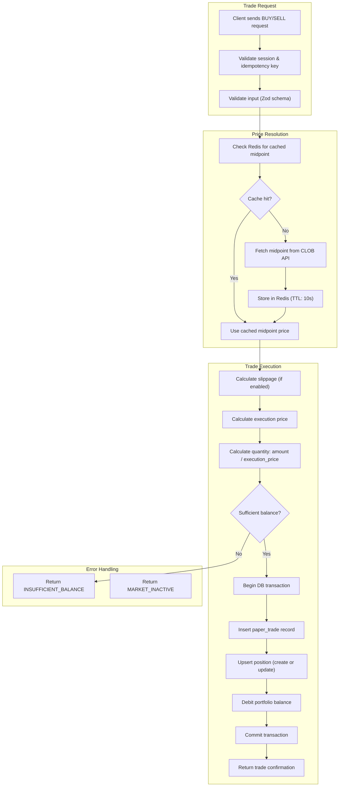

### 5.2 Price Resolution

The paper trading engine uses the **midpoint price** from Polymarket's CLOB API as the execution price. This represents the fair market price between the best bid and best ask.

```typescript
// src/engine/price-resolver.ts

interface PriceData {
  midpoint: number;
  bestBid: number;
  bestAsk: number;
  spread: number;
  timestamp: Date;
}

async function resolvePrice(
  conditionId: string,
  side: "YES" | "NO"
): Promise<PriceData> {
  const cacheKey = `price:${conditionId}`;

  // 1. Check Redis cache (10-second TTL)
  const cached = await redis.get(cacheKey);
  if (cached) {
    return JSON.parse(cached) as PriceData;
  }

  // 2. Fetch from CLOB API
  const [midpointRes, spreadRes] = await Promise.all([
    fetch(`https://clob.polymarket.com/midpoint?token_id=${conditionId}`),
    fetch(`https://clob.polymarket.com/spread?token_id=${conditionId}`),
  ]);

  const midpointData = await midpointRes.json();
  const spreadData = await spreadRes.json();

  const priceData: PriceData = {
    midpoint: parseFloat(midpointData.mid),
    bestBid: parseFloat(spreadData.bid),
    bestAsk: parseFloat(spreadData.ask),
    spread: parseFloat(spreadData.spread),
    timestamp: new Date(),
  };

  // 3. Cache with 10-second TTL
  await redis.set(cacheKey, JSON.stringify(priceData), "EX", 10);

  return priceData;
}
```

### 5.3 Order Execution Logic

```typescript
// src/engine/trade-executor.ts

interface BuyOrder {
  userId: string;
  marketConditionId: string;
  side: "YES" | "NO";
  amount: number; // USD to spend
  idempotencyKey: string;
}

interface TradeResult {
  trade: PaperTrade;
  position: Position;
  portfolio: Portfolio;
}

async function executeBuy(order: BuyOrder): Promise<TradeResult> {
  // 1. Idempotency check
  const existingTrade = await db.query.paperTrades.findFirst({
    where: eq(paperTrades.idempotencyKey, order.idempotencyKey),
  });
  if (existingTrade) {
    throw new ConflictError("Trade already executed with this idempotency key");
  }

  // 2. Get current price
  const price = await resolvePrice(order.marketConditionId, order.side);

  // 3. Get market data for validation
  const market = await db.query.marketCache.findFirst({
    where: eq(marketCache.conditionId, order.marketConditionId),
  });
  if (!market || !market.isActive || market.isResolved) {
    throw new UnprocessableError("MARKET_INACTIVE");
  }

  // 4. Calculate execution price with optional slippage
  const userSettings = await getUserSettings(order.userId);
  let executionPrice = price.midpoint;
  let slippageAmount = 0;

  if (userSettings.slippageEnabled) {
    // Simulate slippage: move price against the trader
    // BUY: price goes up; SELL: price goes down
    const slippageFactor = userSettings.slippageBps / 10000;
    slippageAmount = executionPrice * slippageFactor;
    executionPrice += slippageAmount; // Buying is more expensive
  }

  // Clamp execution price to [0.01, 0.99] range
  executionPrice = Math.max(0.01, Math.min(0.99, executionPrice));

  // 5. Calculate quantity
  const quantity = order.amount / executionPrice;

  // 6. Execute in a transaction
  return await db.transaction(async (tx) => {
    // Check balance
    const portfolio = await tx.query.portfolios.findFirst({
      where: eq(portfolios.userId, order.userId),
    });

    if (!portfolio || parseFloat(portfolio.virtualBalance) < order.amount) {
      throw new UnprocessableError("INSUFFICIENT_BALANCE");
    }

    // Debit balance
    await tx
      .update(portfolios)
      .set({
        virtualBalance: sql`${portfolios.virtualBalance} - ${order.amount}`,
        updatedAt: new Date(),
      })
      .where(eq(portfolios.userId, order.userId));

    // Insert trade record
    const [trade] = await tx
      .insert(paperTrades)
      .values({
        portfolioId: portfolio.id,
        userId: order.userId,
        marketConditionId: order.marketConditionId,
        marketSlug: market.slug,
        marketQuestion: market.question,
        side: order.side,
        action: "BUY",
        quantity: quantity.toFixed(6),
        pricePerShare: executionPrice.toFixed(6),
        totalCost: order.amount.toFixed(6),
        slippageApplied: slippageAmount.toFixed(6),
        idempotencyKey: order.idempotencyKey,
        metadata: {
          midpoint: price.midpoint,
          spread: price.spread,
          bestBid: price.bestBid,
          bestAsk: price.bestAsk,
        },
      })
      .returning();

    // Upsert position (create or add to existing)
    const existingPosition = await tx.query.positions.findFirst({
      where: and(
        eq(positions.portfolioId, portfolio.id),
        eq(positions.marketConditionId, order.marketConditionId),
        eq(positions.side, order.side),
        eq(positions.status, "OPEN")
      ),
    });

    let position;
    if (existingPosition) {
      // Update existing position: recalculate average entry price
      const existingQty = parseFloat(existingPosition.quantity);
      const existingAvg = parseFloat(existingPosition.avgEntryPrice);
      const newTotalQty = existingQty + quantity;
      const newAvgPrice =
        (existingQty * existingAvg + quantity * executionPrice) / newTotalQty;
      const newCostBasis =
        parseFloat(existingPosition.costBasis) + order.amount;

      [position] = await tx
        .update(positions)
        .set({
          quantity: newTotalQty.toFixed(6),
          avgEntryPrice: newAvgPrice.toFixed(6),
          currentPrice: executionPrice.toFixed(6),
          costBasis: newCostBasis.toFixed(6),
          unrealizedPnl: (
            (executionPrice - newAvgPrice) * newTotalQty
          ).toFixed(6),
          updatedAt: new Date(),
        })
        .where(eq(positions.id, existingPosition.id))
        .returning();
    } else {
      // Create new position
      [position] = await tx
        .insert(positions)
        .values({
          portfolioId: portfolio.id,
          userId: order.userId,
          marketConditionId: order.marketConditionId,
          marketSlug: market.slug,
          marketQuestion: market.question,
          side: order.side,
          quantity: quantity.toFixed(6),
          avgEntryPrice: executionPrice.toFixed(6),
          currentPrice: executionPrice.toFixed(6),
          costBasis: order.amount.toFixed(6),
          unrealizedPnl: "0.000000",
          status: "OPEN",
        })
        .returning();
    }

    const updatedPortfolio = await tx.query.portfolios.findFirst({
      where: eq(portfolios.userId, order.userId),
    });

    return { trade, position, portfolio: updatedPortfolio! };
  });
}
```

### 5.4 Position P&L Calculation

```typescript
// P&L formulas for paper trading positions

// ─── Unrealized P&L (open positions) ─────────────────────────
// For YES positions:
//   unrealizedPnl = (currentPrice - avgEntryPrice) * quantity
//
// For NO positions (equivalent — NO shares pay $1 - yesPrice):
//   unrealizedPnl = (currentPrice - avgEntryPrice) * quantity
//
// Note: currentPrice for a YES share is yesPrice from the API.
//       currentPrice for a NO share is (1 - yesPrice) from the API.

// ─── Realized P&L (closed positions) ─────────────────────────
// realizedPnl = (exitPrice - avgEntryPrice) * closedQuantity
//
// Return % = ((exitPrice - avgEntryPrice) / avgEntryPrice) * 100

// ─── Market Resolution ────────────────────────────────────────
// If market resolves YES:
//   YES shares → exitPrice = $1.00  (winner)
//   NO shares  → exitPrice = $0.00  (loser)
//
// If market resolves NO:
//   YES shares → exitPrice = $0.00  (loser)
//   NO shares  → exitPrice = $1.00  (winner)

// ─── Portfolio Total Value ────────────────────────────────────
// totalValue = virtualBalance + Σ(position.quantity * position.currentPrice)
```

### 5.5 Market Resolution Handling

When a Polymarket market resolves, all open positions in that market are automatically settled:

```typescript
// src/engine/resolution-handler.ts

async function handleMarketResolution(
  conditionId: string,
  outcome: "YES" | "NO"
): Promise<void> {
  // Find all open positions for this market
  const openPositions = await db.query.positions.findMany({
    where: and(
      eq(positions.marketConditionId, conditionId),
      eq(positions.status, "OPEN")
    ),
  });

  for (const position of openPositions) {
    await db.transaction(async (tx) => {
      // Determine exit price based on resolution
      const exitPrice =
        position.side === outcome ? 1.0 : 0.0;

      const quantity = parseFloat(position.quantity);
      const avgEntry = parseFloat(position.avgEntryPrice);
      const proceeds = exitPrice * quantity;
      const realizedPnl = (exitPrice - avgEntry) * quantity;
      const returnPct = ((exitPrice - avgEntry) / avgEntry) * 100;

      // 1. Close the position
      await tx
        .update(positions)
        .set({
          status: "RESOLVED",
          currentPrice: exitPrice.toFixed(6),
          unrealizedPnl: "0.000000",
          closedAt: new Date(),
          updatedAt: new Date(),
        })
        .where(eq(positions.id, position.id));

      // 2. Credit proceeds to portfolio
      await tx
        .update(portfolios)
        .set({
          virtualBalance: sql`${portfolios.virtualBalance} + ${proceeds}`,
          realizedPnl: sql`${portfolios.realizedPnl} + ${realizedPnl}`,
          updatedAt: new Date(),
        })
        .where(eq(portfolios.id, position.portfolioId));

      // 3. Record in trade history
      await tx.insert(tradeHistory).values({
        portfolioId: position.portfolioId,
        userId: position.userId,
        positionId: position.id,
        marketConditionId: conditionId,
        marketQuestion: position.marketQuestion,
        side: position.side,
        entryPrice: position.avgEntryPrice,
        exitPrice: exitPrice.toFixed(6),
        quantity: position.quantity,
        realizedPnl: realizedPnl.toFixed(6),
        returnPct: returnPct.toFixed(4),
        closeReason: "MARKET_RESOLVED",
        resolutionOutcome: outcome,
        openedAt: position.openedAt,
      });

      // 4. Record the settlement trade
      await tx.insert(paperTrades).values({
        portfolioId: position.portfolioId,
        userId: position.userId,
        marketConditionId: conditionId,
        marketSlug: position.marketSlug,
        marketQuestion: position.marketQuestion,
        side: position.side,
        action: "SELL",
        quantity: position.quantity,
        pricePerShare: exitPrice.toFixed(6),
        totalCost: proceeds.toFixed(6),
        slippageApplied: "0.000000",
        idempotencyKey: `resolve:${position.id}:${outcome}`,
        metadata: { resolution: true, outcome },
      });
    });
  }
}
```

### 5.6 Virtual Balance Management

| Rule | Value | Notes |
|------|-------|-------|
| Starting balance | $10,000 | Configurable per deployment |
| Minimum trade size | $1.00 | Prevents spam trades |
| Maximum trade size | $10,000 | Prevents extreme concentration |
| Balance reset | Manual, once per 30 days | Users can reset to $10,000 |
| Maximum open positions | 50 | Prevents excessive DB load |

### 5.7 Slippage Simulation

Slippage simulation is an **optional user toggle** (off by default). When enabled:

```
Slippage Model: Fixed basis-point spread applied to midpoint price

  executionPrice = midpoint * (1 + slippageBps / 10000)  [for BUY]
  executionPrice = midpoint * (1 - slippageBps / 10000)  [for SELL]

Default slippage: 50 bps (0.50%)
Configurable range: 0–200 bps
```

This simulates the real-world cost of crossing the spread and moving the market.

---

## 6. Data Flow Diagrams

### 6.1 User Places a Paper Trade

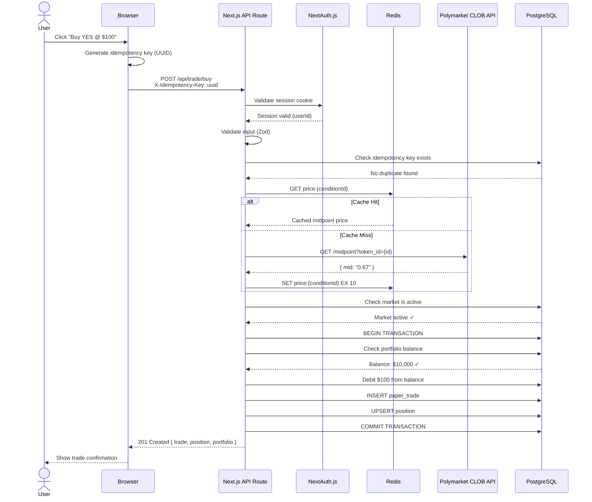

### 6.2 Market Data Refresh Flow

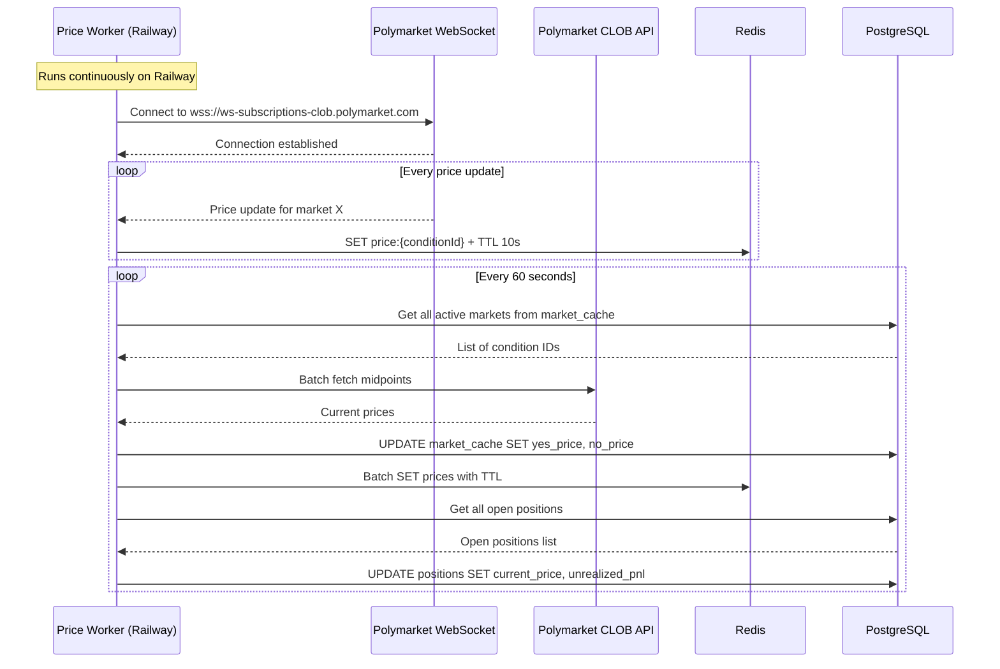

### 6.3 Market Resolution Flow

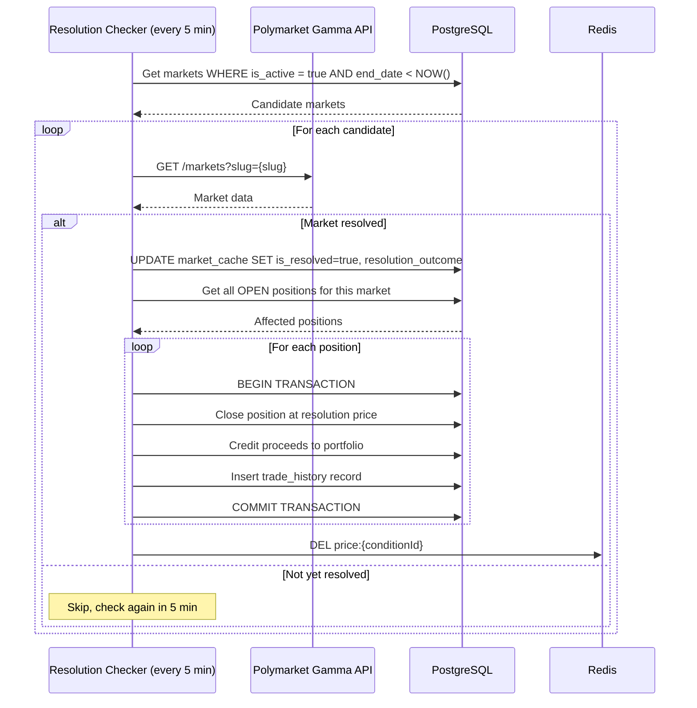

### 6.4 Leaderboard Calculation Flow

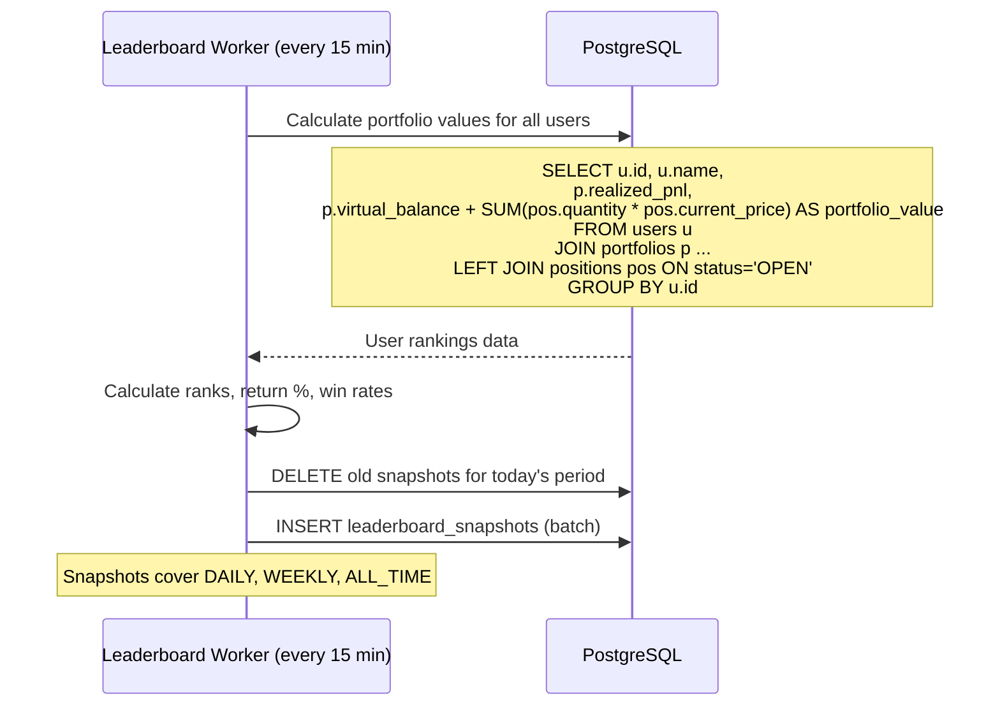

---

## 7. Frontend Architecture

### 7.1 Route Structure

```
app/
├── layout.tsx                    # Root layout (nav, providers, auth)
├── page.tsx                      # Landing / home page
├── (auth)/
│   ├── login/page.tsx            # Login page
│   └── register/page.tsx         # Register page (redirects to login)
├── (app)/
│   ├── layout.tsx                # App shell (sidebar, header)
│   ├── markets/
│   │   ├── page.tsx              # Market browser (SSR + client filters)
│   │   └── [conditionId]/
│   │       └── page.tsx          # Market detail + trading panel
│   ├── portfolio/
│   │   ├── page.tsx              # Portfolio overview (positions, balance)
│   │   └── history/page.tsx      # Trade history with P&L
│   ├── leaderboard/page.tsx      # Leaderboard rankings
│   └── settings/page.tsx         # User settings
├── api/
│   ├── auth/[...nextauth]/route.ts
│   ├── markets/route.ts
│   ├── markets/[conditionId]/route.ts
│   ├── markets/search/route.ts
│   ├── trade/buy/route.ts
│   ├── trade/sell/route.ts
│   ├── trade/close/route.ts
│   ├── portfolio/route.ts
│   ├── portfolio/history/route.ts
│   ├── portfolio/performance/route.ts
│   ├── leaderboard/route.ts
│   ├── user/profile/route.ts
│   └── user/settings/route.ts
└── globals.css
```

### 7.2 Key Components

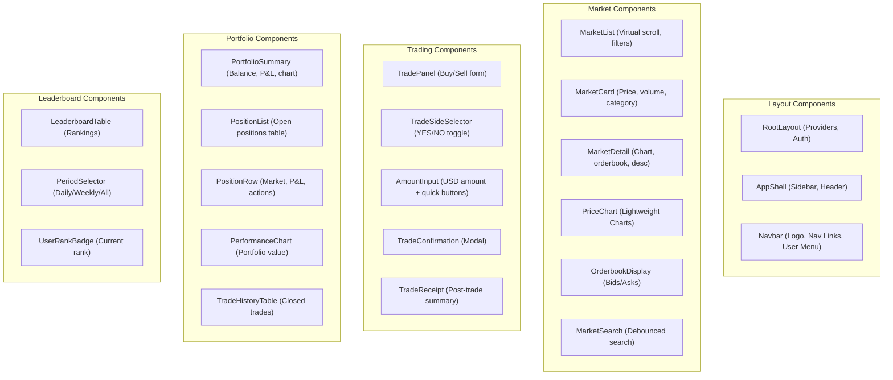

### 7.3 State Management

| Concern | Solution | Why |
|---------|----------|-----|
| **Server state** (markets, portfolio, leaderboard) | TanStack Query (React Query) | Automatic caching, revalidation, optimistic updates, stale-while-revalidate |
| **Client UI state** (modals, filters, sidebar) | Zustand | Lightweight, no boilerplate, persists easily |
| **Auth state** | NextAuth.js `useSession()` | Built-in, SSR-compatible |
| **Form state** | React Hook Form + Zod | Validation shared with API route schemas |
| **Real-time prices** | TanStack Query with 10s `refetchInterval` | Polling is simpler than WebSocket for MVP; upgradeable |

#### TanStack Query Configuration

```typescript
// src/lib/query-client.ts

import { QueryClient } from "@tanstack/react-query";

export const queryClient = new QueryClient({
  defaultOptions: {
    queries: {
      staleTime: 10_000,       // 10 seconds — matches Redis cache TTL
      gcTime: 5 * 60_000,     // 5 minutes garbage collection
      refetchOnWindowFocus: true,
      retry: 2,
    },
  },
});

// Query key factory for type-safe keys
export const queryKeys = {
  markets: {
    all: ["markets"] as const,
    list: (filters: MarketFilters) => ["markets", "list", filters] as const,
    detail: (id: string) => ["markets", "detail", id] as const,
    search: (q: string) => ["markets", "search", q] as const,
  },
  portfolio: {
    all: ["portfolio"] as const,
    summary: () => ["portfolio", "summary"] as const,
    history: (filters?: HistoryFilters) =>
      ["portfolio", "history", filters] as const,
    performance: (period: string) =>
      ["portfolio", "performance", period] as const,
  },
  leaderboard: {
    all: ["leaderboard"] as const,
    byPeriod: (period: string) => ["leaderboard", period] as const,
  },
  user: {
    profile: () => ["user", "profile"] as const,
    settings: () => ["user", "settings"] as const,
  },
};
```

### 7.4 Real-Time Update Strategy

**MVP Approach: Polling via TanStack Query**

| Data | Refresh Interval | Trigger |
|------|------------------|---------|
| Market prices (list page) | 15 seconds | `refetchInterval` |
| Market detail prices | 10 seconds | `refetchInterval` |
| Portfolio positions | 30 seconds | `refetchInterval` + on trade |
| Leaderboard | 5 minutes | `refetchInterval` |

**Future Enhancement: Server-Sent Events (SSE)**

For V2, replace polling with SSE for price updates:
```typescript
// GET /api/stream/prices?markets=0x1234,0x5678
// Sends: event: price\ndata: {"conditionId":"0x1234","yes":0.67}\n\n
```

SSE is preferable over WebSocket for this use case because:
- Simpler server-side implementation (no connection upgrade)
- Works through Vercel's serverless infrastructure with streaming responses
- Automatic reconnection built into the `EventSource` API
- Unidirectional (server → client) is all we need for price feeds

---

## 8. Background Jobs

### 8.1 Worker Architecture

The background worker runs as a single Node.js process on Railway or Fly.io, orchestrating multiple job schedulers:

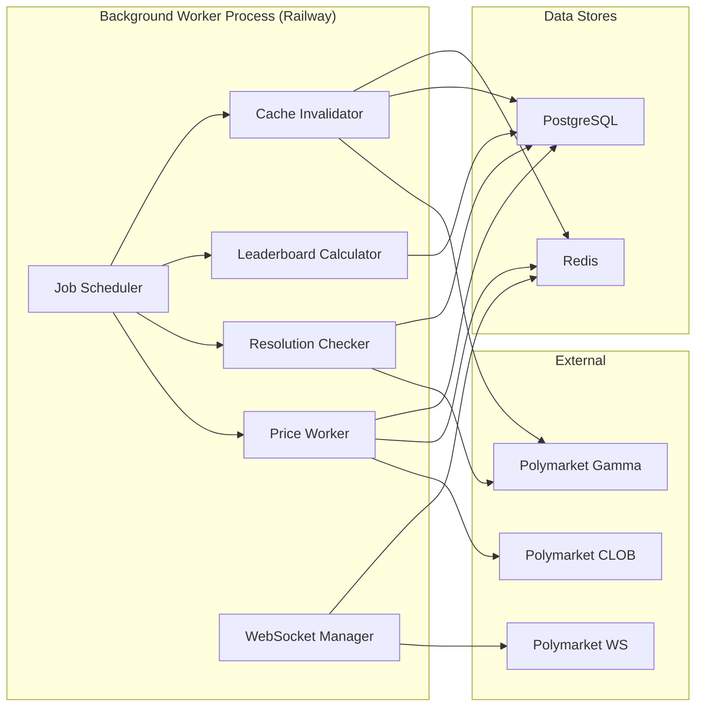

### 8.2 Job Definitions

| Job | Schedule | Timeout | Description |
|-----|----------|---------|-------------|
| **Price Refresh** | Every 30 seconds | 25s | Fetch midpoints for all active markets, update Redis + position P&L |
| **WebSocket Listener** | Continuous | — | Maintain persistent WebSocket to Polymarket for real-time price events |
| **Resolution Checker** | Every 5 minutes | 60s | Check if any markets past end_date have resolved |
| **Leaderboard Calculator** | Every 15 minutes | 120s | Recalculate rankings and insert snapshots |
| **Market Cache Refresh** | Every 10 minutes | 120s | Refresh full market metadata from Gamma API |
| **Stale Cache Cleanup** | Daily at 3:00 AM UTC | 300s | Remove resolved markets older than 90 days from cache |

### 8.3 Price Worker Implementation

```typescript
// worker/jobs/price-refresh.ts

import cron from "node-cron";

export function startPriceRefreshJob() {
  // Runs every 30 seconds
  cron.schedule("*/30 * * * * *", async () => {
    try {
      // 1. Get all active markets with open positions
      const marketsWithPositions = await db
        .selectDistinct({ conditionId: positions.marketConditionId })
        .from(positions)
        .where(eq(positions.status, "OPEN"));

      // 2. Batch fetch prices from CLOB API
      // Polymarket supports batch fetching
      const conditionIds = marketsWithPositions.map((m) => m.conditionId);
      const prices = await batchFetchMidpoints(conditionIds);

      // 3. Update Redis cache
      const pipeline = redis.pipeline();
      for (const [conditionId, price] of Object.entries(prices)) {
        pipeline.set(`price:${conditionId}`, JSON.stringify(price), "EX", 30);
      }
      await pipeline.exec();

      // 4. Update positions with current prices and P&L
      for (const [conditionId, priceData] of Object.entries(prices)) {
        const midpoint = priceData.midpoint;

        // Update all YES positions
        await db
          .update(positions)
          .set({
            currentPrice: midpoint.toFixed(6),
            unrealizedPnl: sql`(${midpoint} - ${positions.avgEntryPrice}::numeric) * ${positions.quantity}::numeric`,
            updatedAt: new Date(),
          })
          .where(
            and(
              eq(positions.marketConditionId, conditionId),
              eq(positions.side, "YES"),
              eq(positions.status, "OPEN")
            )
          );

        // Update all NO positions (price is 1 - yesPrice)
        const noPrice = 1 - midpoint;
        await db
          .update(positions)
          .set({
            currentPrice: noPrice.toFixed(6),
            unrealizedPnl: sql`(${noPrice} - ${positions.avgEntryPrice}::numeric) * ${positions.quantity}::numeric`,
            updatedAt: new Date(),
          })
          .where(
            and(
              eq(positions.marketConditionId, conditionId),
              eq(positions.side, "NO"),
              eq(positions.status, "OPEN")
            )
          );
      }

      // 5. Update market_cache prices
      for (const [conditionId, priceData] of Object.entries(prices)) {
        await db
          .update(marketCache)
          .set({
            yesPrice: priceData.midpoint.toFixed(6),
            noPrice: (1 - priceData.midpoint).toFixed(6),
            fetchedAt: new Date(),
            updatedAt: new Date(),
          })
          .where(eq(marketCache.conditionId, conditionId));
      }

      console.log(`Price refresh complete: ${conditionIds.length} markets`);
    } catch (err) {
      console.error("Price refresh failed:", err);
      // TODO(security): Log error details securely, not to client
    }
  });
}
```

### 8.4 WebSocket Manager

```typescript
// worker/jobs/websocket-manager.ts

import WebSocket from "ws";

const WS_URL = "wss://ws-subscriptions-clob.polymarket.com/ws/market";

export function startWebSocketManager() {
  let ws: WebSocket;
  let reconnectAttempts = 0;
  const MAX_RECONNECT_ATTEMPTS = 10;
  const RECONNECT_BASE_DELAY = 1000; // 1 second

  function connect() {
    ws = new WebSocket(WS_URL);

    ws.on("open", () => {
      console.log("WebSocket connected to Polymarket");
      reconnectAttempts = 0;

      // Subscribe to price updates for tracked markets
      subscribeToMarkets(ws);
    });

    ws.on("message", async (data) => {
      try {
        const message = JSON.parse(data.toString());

        if (message.type === "price_change") {
          const { asset_id, price } = message;
          // Update Redis immediately
          await redis.set(
            `price:${asset_id}`,
            JSON.stringify({
              midpoint: parseFloat(price),
              timestamp: new Date(),
            }),
            "EX",
            15
          );
        }
      } catch (err) {
        console.error("WebSocket message parse error:", err);
      }
    });

    ws.on("close", () => {
      console.log("WebSocket disconnected");
      if (reconnectAttempts < MAX_RECONNECT_ATTEMPTS) {
        const delay = RECONNECT_BASE_DELAY * Math.pow(2, reconnectAttempts);
        reconnectAttempts++;
        console.log(`Reconnecting in ${delay}ms (attempt ${reconnectAttempts})`);
        setTimeout(connect, delay);
      }
    });

    ws.on("error", (err) => {
      console.error("WebSocket error:", err);
    });
  }

  connect();
}
```

---

## 9. Deployment Architecture

### 9.1 Infrastructure Diagram

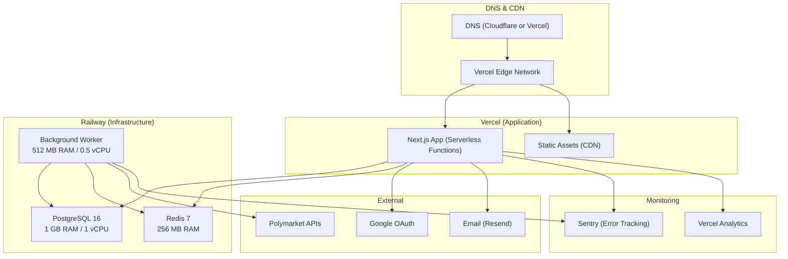

### 9.2 CI/CD Pipeline

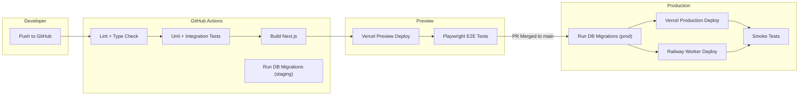

### 9.3 Environment Configuration

| Variable | Development | Staging | Production |
|----------|-------------|---------|------------|
| `DATABASE_URL` | `postgresql://localhost/papertrader` | Railway staging | Railway prod |
| `REDIS_URL` | `redis://localhost:6379` | Railway staging | Railway prod |
| `NEXTAUTH_URL` | `http://localhost:3000` | `https://staging.app.com` | `https://app.com` |
| `NEXTAUTH_SECRET` | Auto-generated | Env var (Railway) | Env var (Railway) |
| `GOOGLE_CLIENT_ID` | Dev credentials | Staging credentials | Prod credentials |
| `GOOGLE_CLIENT_SECRET` | Dev credentials | Staging credentials | Prod credentials |
| `RESEND_API_KEY` | Test key | Staging key | Prod key |
| `SENTRY_DSN` | — | Staging DSN | Prod DSN |
| `NODE_ENV` | `development` | `staging` | `production` |

> [!CAUTION]
> Never commit secrets to source control. All secrets are managed via environment variables in Vercel and Railway dashboards. The `NEXTAUTH_SECRET` must be a cryptographically random string of at least 32 bytes, generated via `openssl rand -base64 32`. Never use a hardcoded fallback value.

---

## 10. Security Considerations

### 10.1 Authentication & Session Security

| Measure | Implementation |
|---------|---------------|
| Session storage | Database-backed sessions via NextAuth.js PostgreSQL adapter |
| Session cookie flags | `HttpOnly`, `Secure`, `SameSite=Lax` |
| Session expiration | 30-day sliding window, absolute max 90 days |
| CSRF protection | Built-in NextAuth.js CSRF tokens on all auth forms |
| OAuth security | Use PKCE flow for Google OAuth; validate `state` parameter |
| Session invalidation | Invalidate all sessions on password change or account deletion |

### 10.2 Rate Limiting Strategy

```typescript
// src/middleware.ts — Rate limiting via Redis sliding window

import { Ratelimit } from "@upstash/ratelimit";
import { Redis } from "@upstash/redis";

const ratelimit = new Ratelimit({
  redis: Redis.fromEnv(),
  limiter: Ratelimit.slidingWindow(60, "1 m"),  // 60 req/min
  analytics: true,
  prefix: "ratelimit:api",
});

const tradeLimiter = new Ratelimit({
  redis: Redis.fromEnv(),
  limiter: Ratelimit.slidingWindow(10, "1 m"),  // 10 trades/min
  prefix: "ratelimit:trade",
});
```

| Endpoint Group | Limit | Window | Key |
|---------------|-------|--------|-----|
| Authenticated API | 60 requests | 1 minute | `userId` |
| Unauthenticated API | 20 requests | 1 minute | IP address |
| Trade endpoints | 10 requests | 1 minute | `userId` |
| Auth endpoints | 5 requests | 1 minute | IP address |
| Search | 30 requests | 1 minute | `userId` or IP |

### 10.3 Input Validation

All API inputs are validated using Zod schemas at the API route boundary:

```typescript
// src/lib/validators/trade.ts

import { z } from "zod";

export const buyTradeSchema = z.object({
  marketConditionId: z
    .string()
    .min(1, "Market condition ID is required")
    .max(255),
  side: z.enum(["YES", "NO"]),
  amount: z
    .number()
    .min(1, "Minimum trade is $1")
    .max(10000, "Maximum trade is $10,000")
    .refine((n) => Number.isFinite(n), "Amount must be a finite number"),
});

export const sellTradeSchema = z.object({
  positionId: z.string().uuid("Invalid position ID"),
  quantity: z.union([
    z.number().positive("Quantity must be positive"),
    z.literal("ALL"),
  ]),
});

export const idempotencyKeySchema = z
  .string()
  .uuid("Idempotency key must be a UUID")
  .min(1);
```

### 10.4 Additional Security Headers

```typescript
// next.config.ts

const securityHeaders = [
  { key: "X-Content-Type-Options", value: "nosniff" },
  { key: "X-Frame-Options", value: "DENY" },
  { key: "X-XSS-Protection", value: "0" }, // Disabled; CSP is the defense
  { key: "Referrer-Policy", value: "strict-origin-when-cross-origin" },
  { key: "Permissions-Policy", value: "camera=(), microphone=(), geolocation=()" },
  {
    key: "Content-Security-Policy",
    value: [
      "default-src 'self'",
      "script-src 'self' 'unsafe-inline'",  // TODO(security): Replace with nonces
      "style-src 'self' 'unsafe-inline'",
      "img-src 'self' https://polymarket.com https://*.polymarket.com data:",
      "connect-src 'self' https://gamma-api.polymarket.com https://clob.polymarket.com",
      "font-src 'self'",
      "object-src 'none'",
      "frame-ancestors 'none'",
    ].join("; "),
  },
  {
    key: "Strict-Transport-Security",
    value: "max-age=63072000; includeSubDomains; preload",
  },
];
```

### 10.5 Data Privacy

- **No real money** is involved — the app only stores virtual portfolio data.
- **PII stored**: email address, display name, profile image URL. Minimal PII footprint.
- **Email masking**: On the leaderboard, emails are never shown — only display names.
- **Account deletion**: Full cascade delete of all user data (trades, positions, history, leaderboard entries). Exposed via `DELETE /api/user/account`.
- **Logging**: Never log session tokens, cookies, or email addresses. Log only non-sensitive identifiers (`userId`, `tradeId`).
- **CORS**: Strict origin allowlist. No wildcard (`*`) origins.

> [!NOTE]
> TODO(security): Add a privacy policy page and cookie consent banner before public launch. Consider GDPR compliance for EU users (data export endpoint).

---

## 11. Scaling Considerations

### 11.1 Caching Strategy

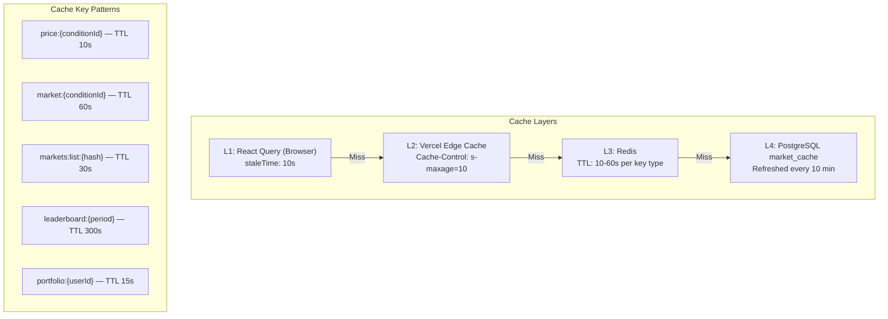

| Data Type | Cache Location | TTL | Invalidation Strategy |
|-----------|---------------|-----|----------------------|
| Market prices | Redis | 10s | Overwritten by price worker |
| Market metadata | Redis + Postgres | 60s / 10 min | Background cache refresh |
| Market list (paginated) | Redis | 30s | TTL expiry |
| Portfolio summary | Redis | 15s | Invalidate on trade |
| Leaderboard | Redis | 5 min | Overwritten by leaderboard worker |
| User settings | Redis | 10 min | Invalidate on update |

### 11.2 Database Optimization

#### Index Strategy

All indexes are defined in the Drizzle schema (§3.2). Key query patterns and their covering indexes:

| Query Pattern | Index Used |
|--------------|-----------|
| Get user's open positions | `positions_user_status_idx (userId, status)` |
| Get position for market+side | `positions_portfolio_market_side_idx (portfolioId, conditionId, side, status)` |
| Leaderboard by period+date | `leaderboard_period_date_idx (period, snapshotDate)` |
| Trade history by user | `trade_history_user_idx (userId)` |
| Market search by slug | `market_cache_slug_idx (slug)` |
| Active markets only | `market_cache_active_idx (isActive)` |

#### Connection Pooling

```typescript
// src/db/index.ts

import { drizzle } from "drizzle-orm/node-postgres";
import { Pool } from "pg";

const pool = new Pool({
  connectionString: process.env.DATABASE_URL,
  max: 20,              // Max connections in pool
  idleTimeoutMillis: 30_000,
  connectionTimeoutMillis: 5_000,
  ssl: process.env.NODE_ENV === "production" ? { rejectUnauthorized: true } : false,
});

export const db = drizzle(pool, { schema });
```

> [!TIP]
> For Vercel serverless, consider using [Neon](https://neon.tech) with their serverless driver or a connection pooler like PgBouncer to avoid exhausting connections across many concurrent serverless function invocations.

#### Partitioning Strategy (Future)

At scale (>100K trades), partition `paper_trades` and `trade_history` by month:

```sql
-- Future: partition by month for trades
CREATE TABLE paper_trades (
  ...
) PARTITION BY RANGE (executed_at);

CREATE TABLE paper_trades_2026_06
  PARTITION OF paper_trades
  FOR VALUES FROM ('2026-06-01') TO ('2026-07-01');
```

### 11.3 WebSocket Connection Pooling

The background worker maintains a single WebSocket connection to Polymarket and fans out updates to Redis. The frontend clients poll Redis via the API — they never connect directly to Polymarket's WebSocket.

```
Polymarket WS ──(1 connection)──> Worker ──> Redis ──> API ──> N clients
```

This architecture means scaling users does not increase WebSocket connections to Polymarket. At 10,000 users, there is still only 1 WebSocket connection.

### 11.4 Scaling Milestones

| Users | Architecture Change Needed |
|-------|---------------------------|
| **0–1,000** | MVP as designed. Single Railway instance for worker + DB + Redis. |
| **1,000–5,000** | Add read replica for PostgreSQL. Increase Redis memory to 1 GB. |
| **5,000–10,000** | Move to PgBouncer for connection pooling. Consider Neon serverless Postgres. Add a second worker instance for redundancy. |
| **10,000–50,000** | Partition trade tables by month. Add dedicated SSE/WebSocket service (e.g., Soketi on Fly.io). Consider moving to Vercel Edge Functions for API routes. |
| **50,000+** | Migrate worker to Kubernetes. Add horizontal autoscaling for API. Shard leaderboard calculation. Consider event sourcing for trades. |

---

## 12. Cost Estimation

### 12.1 MVP (~1,000 Users)

| Service | Tier | Monthly Cost |
|---------|------|-------------|
| **Vercel** | Pro Plan | $20 |
| **Railway PostgreSQL** | Starter (1 GB RAM, 10 GB disk) | $5–10 |
| **Railway Redis** | Starter (256 MB RAM) | $3–5 |
| **Railway Worker** | Starter (512 MB RAM, 0.5 vCPU) | $5–7 |
| **Resend** (email auth) | Free tier (3K emails/mo) | $0 |
| **Sentry** | Developer (free) | $0 |
| **Domain** | .com | $1 (amortized) |
| **Total** | | **~$35–45/mo** |

### 12.2 Growth (~10,000 Users)

| Service | Tier | Monthly Cost |
|---------|------|-------------|
| **Vercel** | Pro Plan (increased usage) | $20–40 |
| **Railway PostgreSQL** | Pro (4 GB RAM, 50 GB disk, read replica) | $30–50 |
| **Railway Redis** | Pro (1 GB RAM) | $10–15 |
| **Railway Worker** | Pro (1 GB RAM, 1 vCPU, 2 instances) | $15–25 |
| **Resend** | Pro (50K emails/mo) | $20 |
| **Sentry** | Team | $26 |
| **Cloudflare** (DNS + DDoS) | Free | $0 |
| **Total** | | **~$120–175/mo** |

### 12.3 Cost Optimization Strategies

1. **Vercel Edge caching** — Serve market list pages from edge cache, reducing serverless function invocations by ~70%.
2. **Redis key expiration** — Don't cache prices for markets with no open positions. Reduces Redis memory by ~50%.
3. **Batch API calls** — The price worker fetches all midpoints in a single batch request rather than N individual calls.
4. **Smart polling** — Only poll prices for markets where users have open positions. Idle markets are fetched on-demand.
5. **Leaderboard caching** — The leaderboard is computed once every 15 minutes and cached, not recalculated on every request.

---

## Appendix A: Polymarket API Reference

| API | Base URL | Key Endpoints Used |
|-----|----------|-------------------|
| **Gamma API** | `https://gamma-api.polymarket.com` | `GET /events`, `GET /markets`, `GET /markets?slug=` |
| **CLOB Data API** | `https://clob.polymarket.com` | `GET /midpoint`, `GET /spread`, `GET /price`, `GET /prices-history` |
| **WebSocket** | `wss://ws-subscriptions-clob.polymarket.com/ws/market` | Subscribe to market price channels |
| **Data API** | `https://data-api.polymarket.com` | `GET /leaderboard` (reference only) |

All Polymarket read APIs are free and require no authentication.

## Appendix B: Key Technical Decisions Log

| Decision | Choice | Rationale |
|----------|--------|-----------|
| Database sessions over JWT | Database-backed | No client-side token theft risk; instant session revocation on logout |
| Midpoint price for execution | Midpoint | Fair price between bid/ask; simpler than simulating orderbook impact |
| Background worker on Railway | Separate process | Vercel serverless has 10s–300s timeout limits; workers need persistent connections |
| Drizzle over Prisma | Drizzle ORM | SQL-like API, smaller bundle, faster queries, no query engine binary |
| Cursor pagination over offset | Cursor-based | O(1) performance regardless of page depth; offset degrades at scale |
| Idempotency keys for trades | Client UUID | Prevents double-execution from network retries or double-clicks |
| Polling over WebSocket for frontend | TanStack Query polling | Simpler for MVP; Vercel-compatible; avoids WebSocket infrastructure |
| `decimal(18,6)` for money | High precision | Prevents floating-point rounding errors in P&L calculations |

---

> [!TIP]
> **Getting Started**: Clone the repo, run `pnpm install`, copy `.env.example` to `.env.local`, start PostgreSQL and Redis locally, run `pnpm db:push` to set up the schema, then `pnpm dev` to start the dev server.
