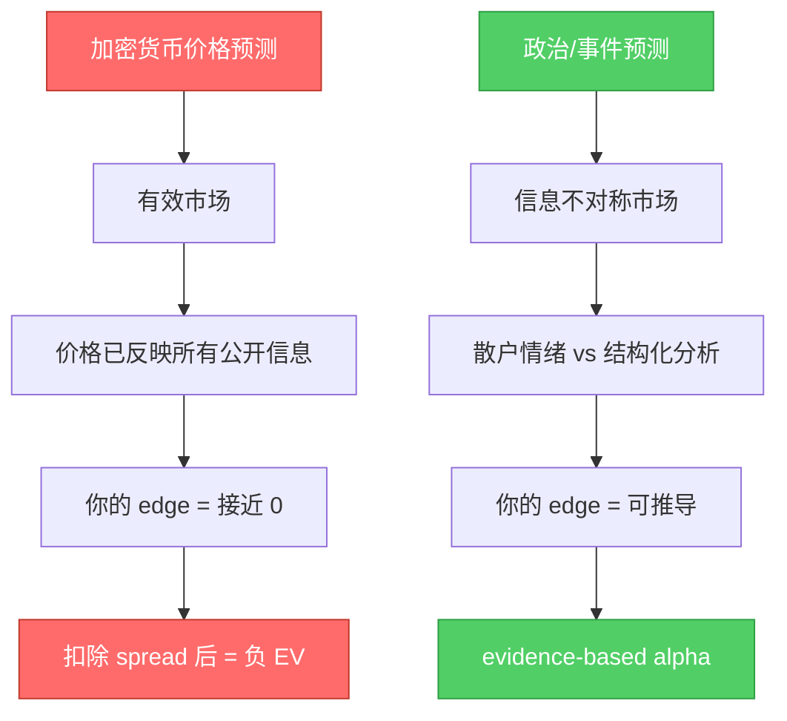
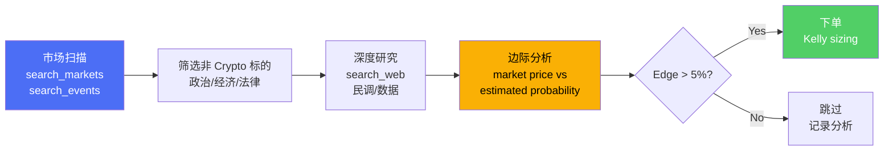

# 🎯 策略 Alpha 分析：为什么不应该只做虚拟币

## 核心论点

你说得**完全正确**。这个平台的策略选择犯了一个根本性错误：

> **在预测市场上交易加密货币价格 = 用最差的工具做最难的事**

---

## 📊 当前策略的问题

从最近的交易报告来看 ([2026-07-07 report](file:///usr/local/google/home/dickensli/polymarket-paper-trader/docs/reports/2026-07-07T23_00_00.md))：

| 资产 | 入场价 (YES) | 出场价 (YES) | 盈亏 |
|------|------------|------------|------|
| BTC | $0.75 | $0.52 | **-$306.67** |
| ETH | $0.78 | $0.59 | **-$243.59** |
| SOL | $0.75 | $0.49 | **-$346.67** |
| **合计** | | | **-$896.93** |

> [!CAUTION]
> 单次交易亏损 **$897**，整个逻辑就是在猜 15 分钟内的价格动量。这和在 Coinbase/Binance 做杠杆交易没有本质区别。

---

## 🧠 为什么在预测市场做 Crypto 没有 Alpha

### 根本问题

| 维度 | Crypto 价格预测 | 政治/事件预测 |
|------|:---:|:---:|
| **信息优势** | ❌ 几乎不可能 — 机构量化团队 24/7 盯盘 | ✅ 可通过深入分析获得 |
| **可推导性** | ❌ 随机游走 + 鲸鱼操纵 | ✅ 有投票数据、民调、政策逻辑链 |
| **时间框架** | ❌ 15分钟动量 = 纯噪音 | ✅ 天/周级别 = 可研究 |
| **竞争对手** | ❌ 高频做市商 + 套利机器人 | ✅ 散户为主，信息处理能力弱 |
| **vs 直接交易** | ❌ 不如直接用 Coinbase（更好的流动性） | ✅ **只有预测市场才能交易这些事件** |
| **AI 优势** | ❌ 技术指标 AI 已是红海 | ✅ 信息聚合 + 推理 = AI 天然优势 |

> [!IMPORTANT]
> **关键洞察**: 如果只是赌 BTC 涨跌，你在 Polymarket 上做**还不如**直接去 Coinbase — 
> 因为 Coinbase 有更好的流动性、更低的 spread、更多的工具。  
> 预测市场的独特价值在于**你能交易那些传统交易所无法交易的标的**。

---

## ✅ 高 Alpha 的事件驱动策略方向

### 1. 🏛️ 政治与选举 (Highest Alpha)
- **美国/全球选举**: 民调数据 vs 市场定价的持续偏差
- **政策决策**: Fed 利率决议、政府关门、债务上限
- **立法预测**: 法案通过概率
- **AI 优势**: 可聚合大量民调、历史投票记录、政治捐款数据做贝叶斯推理

### 2. ⚖️ 法律与监管
- **法院判决**: 最高法院案件（有 oral arguments 可分析）
- **反垄断**: Google/Apple/Meta 反垄断裁决
- **监管动向**: SEC 执法、ETF 批准
- **AI 优势**: 法律文档分析 + 先例推理

### 3. 🌍 地缘政治与国际
- **外交谈判**: 停火协议、贸易协定
- **国际组织决策**: UN 投票、WHO 声明
- **制裁/关税**: 基于政治逻辑链可推导
- **AI 优势**: 多语言信息聚合，跨文化分析

### 4. 📈 经济指标 (结构化数据)
- **GDP/CPI/就业数据**: 有大量先行指标可建模
- **央行决策**: Fed/ECB/BOJ 利率
- **AI 优势**: 时间序列分析 + 专家共识 + 领先指标

### 5. 🏆 体育赛事 (成熟市场)
- **NBA/NFL/足球**: 有丰富的统计模型
- **AI 优势**: 伤病数据、对战历史、高级统计

### 6. 🔬 科学与技术
- **药物审批**: FDA panel votes 有先行指标
- **太空任务**: 技术可行性分析
- **AI 优势**: 论文分析 + 技术评估

---

## 📐 策略对比矩阵

| 策略类型 | Edge 来源 | 可推导性 | 平台独特性 | 竞争强度 | **综合评分** |
|---------|----------|---------|-----------|---------|:---:|
| Crypto 15min 动量 | 技术面 | ⭐ | ⭐ | ⭐⭐⭐⭐⭐ | **D** |
| Crypto 跨平台套利 | 价差 | ⭐⭐⭐ | ⭐⭐ | ⭐⭐⭐⭐ | **C** |
| 选举/政治 | 民调+推理 | ⭐⭐⭐⭐⭐ | ⭐⭐⭐⭐⭐ | ⭐⭐ | **A+** |
| 经济指标 | 先行指标 | ⭐⭐⭐⭐ | ⭐⭐⭐⭐ | ⭐⭐⭐ | **A** |
| 法律判决 | 文档分析 | ⭐⭐⭐⭐ | ⭐⭐⭐⭐⭐ | ⭐⭐ | **A** |
| 地缘政治 | 情报聚合 | ⭐⭐⭐⭐ | ⭐⭐⭐⭐⭐ | ⭐⭐ | **A** |
| 体育赛事 | 统计模型 | ⭐⭐⭐⭐ | ⭐⭐⭐ | ⭐⭐⭐⭐ | **B+** |

---

## 🔧 建议的行动计划

### Phase 1: 立即行动 — 停止 Crypto 动量策略
- 暂停 `high_freq_retro` 等纯 crypto 价格动量策略
- 保留 crypto 跨平台套利（如果存在结构性价差）

### Phase 2: 构建事件驱动研究管道

### Phase 3: 注册新策略
建议的新策略配置：

| 策略名 | 平台 | 标的类型 | 研究方法 |
|--------|------|---------|---------|
| `political_events` | Polymarket / Kalshi | 政治选举 | 民调聚合 + 贝叶斯更新 |
| `macro_indicators` | Kalshi | 经济指标 | 先行指标 + 专家共识 |
| `legal_outcomes` | Polymarket / Kalshi | 法律判决 | 法律文档分析 |
| `geopolitical` | Polymarket | 国际事件 | 多源情报聚合 |

---

## 💡 AI Agent 在事件市场的天然优势

> [!TIP]
> AI 做事件预测比做 crypto 价格预测有**结构性优势**：
> 1. **信息聚合**: 可以同时处理数百个数据源（民调、新闻、历史数据）
> 2. **贝叶斯推理**: 随着新证据出现持续更新概率估计
> 3. **无情绪偏差**: 不受 recency bias 或 confirmation bias 影响
> 4. **跨语言**: 可以聚合英文、中文、法文等多语言信息源
> 5. **24/7 监控**: 可以持续跟踪事件发展

这正是你说的 — **政治经济国际形势有很强的可以推导的 evidence**。AI agent 的能力恰好匹配这种需要大量信息聚合和逻辑推理的任务。

---

## ⚡ TL;DR

| 问题 | 答案 |
|------|------|
| **为什么不应该只做 Crypto？** | 没有信息优势，不如直接去 Coinbase |
| **预测市场的真正 Alpha 在哪？** | 政治/经济/法律等**只能在预测市场交易**的事件 |
| **AI 的结构性优势在哪？** | 信息聚合 + 逻辑推理 + 贝叶斯更新 |
| **下一步？** | 停止 crypto 动量，注册事件驱动策略 |
